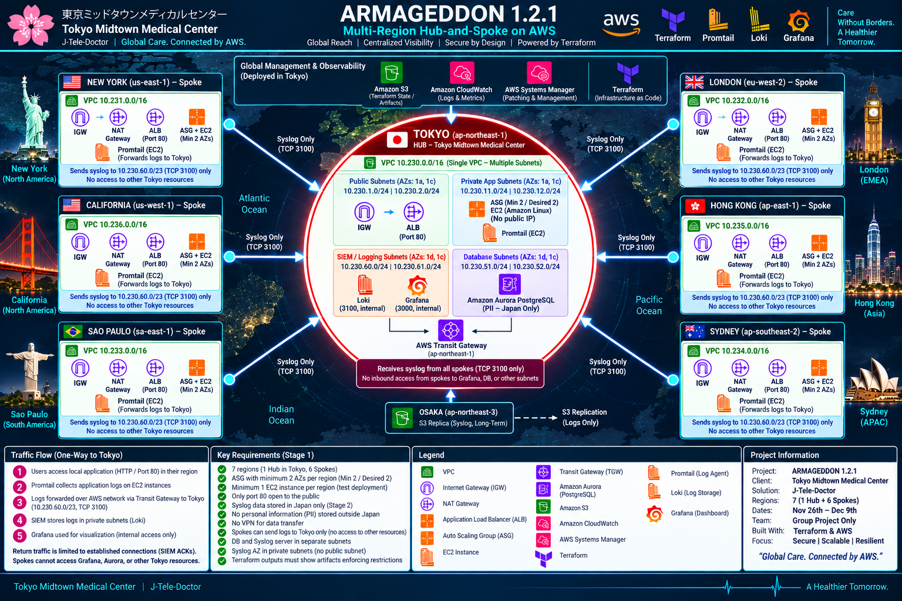

# **Armageddon 1.2.1 — TMMC J-Tele-Doctor**


> **Tokyo Midtown Medical Center — J-Tele-Doctor**  
> A Terraform-built AWS multi-region hub-and-spoke platform that provides regional application hosting while centralizing security logging and PII inside Japan.

---

## **Table of Contents**

1. [**Project Overview**](#1-project-overview)
2. [**Project Requirements**](#2-project-requirements)
3. [**Architecture**](#3-architecture)
4. [**Project and Folder Structure**](#4-project-and-folder-structure)
5. [**Steps Used to Complete the Project**](#5-steps-used-to-complete-the-project)
6. [**Artifacts and Screenshots**](#6-artifacts-and-screenshots)
7. [**Teardown and Cost Control**](#7-teardown-and-cost-control)
8. [**Lessons Learned**](#8-lessons-learned)
9. [**References**](#9-references)
10. [**Troubleshooting**](#10-troubleshooting)
11. [**Author and Contributors**](#11-author-and-contributors)

---

## **1. Project Overview**

ARMAGEDDON 1.2.1 implements a **seven-region AWS hub-and-spoke architecture** for Tokyo Midtown Medical Center's **J-Tele-Doctor** platform.

The design provides local application hosting in:

- Tokyo
- New York
- London
- São Paulo
- Sydney
- Hong Kong
- California

Tokyo (`ap-northeast-1`) is the central hub. The remaining six application regions operate as spokes.

The architecture is designed to demonstrate the following:

- Regional web application hosting.
- Application Load Balancers exposed on **HTTP port 80 only**.
- Auto Scaling Groups spanning at least two Availability Zones.
- Application EC2 instances located in **private subnets with no public IP addresses**.
- Inter-region connectivity using **AWS Transit Gateway peering**.
- Promtail log collection in every application region.
- Centralized Loki/Grafana observability in Tokyo.
- Spoke-to-Tokyo syslog access restricted to **`10.230.60.0/23` on TCP 3100**.
- PII stored only in Japan.
- Aurora PostgreSQL hosted only inside the Tokyo VPC.
- No VPN or VGW-based data-transfer path.
- Syslog S3 replication from Tokyo to Osaka (`ap-northeast-3`) for long-term storage.

Operational procedures for deployment, E2E testing, teardown, and troubleshooting are maintained in:

[**RUNBOOK.md**](documentation/RUNBOOK.md)

Project specifications:

- `documentation/Armageddon-Project-Class-6-V1.1.docx`
- `documentation/Armageddon-Project-Class-6-V1.2.docx`
- `documentation/Armageddon.xlsx`

---

## **2. Project Requirements**

### **2.1 Required Tools**

| **Tool / Platform**  | **Required** | **Purpose**                                                            |
| -------------------- | -----------: | ---------------------------------------------------------------------- |
| **Terraform >= 1.0** | Yes          | Provisions the AWS infrastructure as code.                             |
| **AWS CLI v2**       | Yes          | Authentication, validation, operational checks, and script automation. |
| **AWS Console**      | Recommended  | Visual verification and troubleshooting of deployed resources.         |
| **Python 3**         | Yes          | Supports project automation and validation workflows.                  |
| **Git**              | Yes          | Source control and project submission.                                 |
| **Bash / Git Bash**  | Yes          | Runs deployment and teardown scripts.                                  |
| **curl**             | Yes          | Tests regional application endpoints.                                  |

### **2.2 AWS Account Requirements**

The AWS account must permit deployment across the application regions plus the Osaka replication region.

Required region access:

| **Location**  | **AWS Region**   | **Role**               |
| ------------- | ---------------- | ---------------------- |
| Tokyo         | `ap-northeast-1` | Hub                    |
| New York      | `us-east-1`      | Spoke                  |
| London        | `eu-west-2`      | Spoke                  |
| São Paulo     | `sa-east-1`      | Spoke                  |
| Sydney        | `ap-southeast-2` | Spoke                  |
| Hong Kong     | `ap-east-1`      | Spoke                  |
| N. California | `us-west-1`      | Spoke                  |
| Osaka         | `ap-northeast-3` | S3 syslog replica only |

> **Important:** Hong Kong (`ap-east-1`) and Osaka (`ap-northeast-3`) must be enabled in the AWS account before deployment.

The Terraform remote-state bucket used by the project is:

```text
armageddon-tiqs-state-files
```

Region:

```text
us-east-1
```

### **2.3 Security and Architecture Requirements**

- Public web access is limited to **TCP 80** through regional ALBs.

- Application EC2 instances use **private subnets** and do not receive public IP addresses.

- Application ASGs use **minimum 2 / desired 2** instances.

- Syslog data must remain in Japan.

- PII must remain in Japan.

- Spokes may reach only the Tokyo SIEM CIDR:
  - `10.230.60.0/23`
  - TCP `3100`

- Spokes cannot reach:
  - Grafana `:3000`
  - Aurora database subnets
  - SSH endpoints in Tokyo
  - Other Tokyo application or infrastructure subnets

- No VPN is used for inter-region data transfer.

- SIEM and database workloads use separate restricted private subnet tiers.

- The restricted Tokyo AZ `1d` contains **no public subnet**.

- Terraform outputs provide evidence of the controls used to enforce restricted syslog access.

---

## **3. Architecture**

### **3.1 High-Level Architecture**

Tokyo contains the central **hub VPC**:

```text
10.230.0.0/16
```

The six application regions each have a dedicated `/16` spoke VPC.

Osaka is **not** another application VPC. It is used for S3 replication of long-term syslog data.



### **3.2 Regional VPC Addressing**

| **Location**           | **AWS Region**   | **VPC CIDR**    |
| ---------------------- | ---------------- | --------------- |
| **Tokyo (Hub)**        | `ap-northeast-1` | `10.230.0.0/16` |
| **New York**           | `us-east-1`      | `10.231.0.0/16` |
| **London**             | `eu-west-2`      | `10.232.0.0/16` |
| **São Paulo**          | `sa-east-1`      | `10.233.0.0/16` |
| **Sydney**             | `ap-southeast-2` | `10.234.0.0/16` |
| **Hong Kong**          | `ap-east-1`      | `10.235.0.0/16` |
| **California**         | `us-west-1`      | `10.236.0.0/16` |
| **Osaka — S3 replica** | `ap-northeast-3` | N/A             |

### **3.3 CIDR / Subnet Matrix**

The following table is aligned to the project CIDR workbook.

| **Region** | **Public AZ 1A** | **Public AZ 1C** | **Private AZ 1A** | **Private AZ 1C** |
| ---------- | ---------------- | ---------------- | ----------------- | ----------------- |
| Tokyo      | `10.230.1.0/24`  | `10.230.2.0/24`  | `10.230.11.0/24`  | `10.230.12.0/24`  |
| New York   | `10.231.1.0/24`  | `10.231.2.0/24`  | `10.231.11.0/24`  | `10.231.12.0/24`  |
| London     | `10.232.1.0/24`  | `10.232.2.0/24`  | `10.232.11.0/24`  | `10.232.12.0/24`  |
| São Paulo  | `10.233.1.0/24`  | `10.233.2.0/24`  | `10.233.11.0/24`  | `10.233.12.0/24`  |
| Sydney     | `10.234.1.0/24`  | `10.234.2.0/24`  | `10.234.11.0/24`  | `10.234.12.0/24`  |
| Hong Kong  | `10.235.1.0/24`  | `10.235.2.0/24`  | `10.235.11.0/24`  | `10.235.12.0/24`  |
| California | `10.236.1.0/24`  | `10.236.2.0/24`  | `10.236.11.0/24`  | `10.236.12.0/24`  |

Full CIDR reference:

[**Armageddon.xlsx**](documentation/Armageddon.xlsx)

### **3.4 Tokyo Hub Subnet Design**

Tokyo uses **one VPC** with multiple subnet tiers.

#### Public Application Subnets

```text
10.230.1.0/24 — AZ 1a
10.230.2.0/24 — AZ 1c
```

Purpose:

- Internet-facing ALB
- Public routing through the Internet Gateway

#### Private Application Subnets

```text
10.230.11.0/24 — AZ 1a
10.230.12.0/24 — AZ 1c
```

Purpose:

- Application Auto Scaling Group
- EC2 instances
- Promtail
- No public IP addresses

#### Restricted SIEM / Logging Subnets

```text
10.230.60.0/24 — AZ 1d
10.230.61.0/24 — AZ 1c
```

Aggregated SIEM route advertised to spokes:

```text
10.230.60.0/23
```

Services:

- Loki internal NLB — TCP `3100`
- Grafana internal ALB — TCP `3000`

#### Restricted Database Subnets

```text
10.230.51.0/24 — AZ 1d
10.230.52.0/24 — AZ 1c
```

Service:

- Amazon Aurora PostgreSQL
- Encryption enabled
- Reachable by the Tokyo application security group only
- PII remains in Japan

#### Tokyo Availability-Zone Constraint

This AWS account uses Tokyo AZs:

```text
1a
1c
1d
```

Application tiers span:

```text
1a + 1c
```

Restricted SIEM and database tiers span:

```text
1d + 1c
```

This intentionally causes the restricted tiers to share AZ `1c` with the application tier while preserving the project requirement that **AZ `1d` contains no public subnet**.

### **3.5 Spoke Application Pattern**

Each spoke follows the same basic flow:

```text
Internet
   |
   v
Internet Gateway
   |
   v
Public Application Load Balancer :80
   |
   v
Private Auto Scaling Group
   |
   +--> EC2 Instance
   +--> EC2 Instance
   |
   v
Promtail
   |
   v
Regional Transit Gateway
   |
   v
TGW Peering
   |
   v
Tokyo Transit Gateway
   |
   v
10.230.60.0/23 :3100
   |
   v
Loki
```

Each regional application ASG is configured for:

```text
Minimum: 2
Desired: 2
```

Hong Kong uses `t3.micro` because `t2.micro` is not available in `ap-east-1`. Other application regions use `t2.micro`.

### **3.6 Syslog Security Path**

The spoke routing policy is intentionally narrow.

Allowed destination:

```text
10.230.60.0/23 TCP/3100
```

Not allowed from spokes:

```text
Grafana :3000
Aurora / DB subnets
SSH
Tokyo application subnets
Other 10.230.0.0/16 resources
```

Return traffic is limited to the established SIEM connection required for Loki acknowledgements.

---

## **4. Project and Folder Structure**

```text
Armageddon 1.2.1/
├── documentation/
│
│   ├── Armageddon-Project-Class-6-V1.1.docx
│   ├── Armageddon-Project-Class-6-V1.2.docx
│   ├── armageddon.png
│   ├── Armageddon.xlsx
│   └── RUNBOOK.md
├── scripts/
│
│   ├── 1-user-data.sh
│   ├── 2-grafana.sh
│   ├── 3-run-lab.sh
│   └── 4-teardown-lab.sh
│
├── terraform/
│   ├── 0-providers.tf
│   ├── 1-variables.tf
│   ├── 2-new-york.tf
│   ├── 3-london.tf
│   ├── 4-sao-paulo.tf
│   ├── 5-sydney.tf
│   ├── 6-hong-kong.tf
│   ├── 7-california.tf
│   ├── 8-tokyo.tf
│   ├── 9-aurora-db.tf
│   ├── 10-siem.tf
│   ├── 11a-tgw-new-york.tf
│   ├── 11b-tgw-london.tf
│   ├── 11c-tgw-sao-paulo.tf
│   ├── 11d-tgw-sydney.tf
│   ├── 11e-tgw-hong-kong.tf
│   ├── 11f-tgw-california.tf
│   ├── 12-ami.tf
│   ├── A-backend.tf
│   └── B-outputs.tf
│
├── .gitignore
└── README.md
```

### Key Files

| **File**                    | **Purpose**                                                                       |
| --------------------------- | --------------------------------------------------------------------------------- |
| `scripts/1-user-data.sh`    | Installs/configures Apache and Promtail for regional application EC2 instances.   |
| `scripts/2-grafana.sh`      | Installs/configures Loki and Grafana on the SIEM tier.                            |
| `scripts/3-run-lab.sh`      | Deploys the stack and performs live E2E validation.                               |
| `scripts/4-teardown-lab.sh` | Empties syslog buckets as required and destroys Terraform-managed infrastructure. |
| `terraform/8-tokyo.tf`      | Tokyo application networking and resources.                                       |
| `terraform/9-aurora-db.tf`  | Tokyo Aurora PostgreSQL tier.                                                     |
| `terraform/10-siem.tf`      | Tokyo Loki/Grafana SIEM tier.                                                     |
| `terraform/11a`–`11f`       | Transit Gateway peering for the six spoke regions.                                |
| `terraform/12-ami.tf`       | Regional Amazon Linux AMI lookups.                                                |
| `terraform/A-backend.tf`    | Terraform S3 remote-state configuration.                                          |
| `terraform/B-outputs.tf`    | Validation and project evidence outputs.                                          |

---

## **5. Steps Used to Complete the Project**

### **Step 1 — Prepare the Workstation**

Confirm required tools:

```bash
terraform version
aws --version
python --version
git --version
curl --version
```

Authenticate the AWS CLI and verify the active identity:

```bash
aws sts get-caller-identity
```

### **Step 2 — Verify Region Access**

Confirm the project account can use all required AWS regions.

Pay particular attention to:

```text
ap-east-1       # Hong Kong
ap-northeast-3  # Osaka
```

These regions may require explicit account enablement.

### **Step 3 — Verify Terraform Remote State**

Confirm the remote-state bucket exists:

```text
armageddon-tiqs-state-files
```

The bucket is intentionally maintained outside normal lab teardown so Terraform state remains available.

### **Step 4 — Review the CIDR Plan**

Before deployment, validate the VPC and subnet ranges against:

```text
documentation/Armageddon.xlsx
```

This prevents CIDR overlap between Tokyo and the six spoke VPCs.

### **Step 5 — Review Terraform Configuration**

Terraform configuration is stored in:

```text
terraform/
```

The files separate regional application stacks, Tokyo services, Aurora, SIEM, Transit Gateway peering, AMI discovery, backend configuration, and outputs.

### **Step 6 — Run the Automated Deployment**

From the **repository root**:

```bash
bash scripts/3-run-lab.sh
```

The run script deploys the environment and executes live validation checks.

> Do not run Terraform directly from the repository root. Manual Terraform commands should be run from `terraform/`.

### **Step 7 — Validate Regional Applications**

For each application region, confirm:

- ALB is reachable on HTTP port `80`.
- ASG minimum and desired capacity are `2`.
- EC2 instances are deployed in private subnets.
- EC2 instances do not have public IP addresses.
- Promtail is installed and running.

### **Step 8 — Validate Transit Gateway Connectivity**

Confirm each spoke has:

- Regional Transit Gateway connectivity.
- Peering toward Tokyo.
- Route to `10.230.60.0/23`.
- No route permitting general access to the Tokyo VPC.

### **Step 9 — Validate Centralized Logging**

Confirm that regional Promtail agents forward logs to the Tokyo Loki service:

```text
TCP 3100
10.230.60.0/23
```

Confirm the spokes cannot access Grafana or other Tokyo resources.

### **Step 10 — Validate Grafana**

Grafana is internal to the Tokyo VPC.

Confirm:

- Grafana listens on TCP `3000`.
- Access is restricted to the Tokyo environment.
- Loki is configured as the log data source.
- Regional application logs are visible.

### **Step 11 — Validate Aurora PostgreSQL**

Confirm:

- Aurora is located in the restricted Tokyo database subnets.
- Database storage is encrypted.
- The database is not publicly accessible.
- Only the Tokyo application security group is permitted to reach the database.
- Spokes have no database route.

### **Step 12 — Validate S3 Syslog Replication**

Confirm syslog objects are stored in Tokyo and replicated to Osaka:

```text
Tokyo -> Osaka
ap-northeast-1 -> ap-northeast-3
```

Osaka contains no application VPC for this design.

### **Step 13 — Capture Terraform Evidence**

Capture relevant Terraform outputs showing that project controls are enforced.

Examples include evidence for:

- Spoke routing restrictions.
- SIEM destinations.
- Transit Gateway connectivity.
- Private subnet placement.
- Database isolation.
- S3 replication.

### **Step 14 — Run End-to-End Validation**

The latest documented full run produced:

```text
66 PASS
1 WARN
0 FAIL
```

The warning represents the documented Tokyo `1c` application/restricted AZ overlap.

### **Step 15 — Capture Screenshots**

Before teardown, capture evidence of all required resources and tests.

Suggested evidence is listed in the next section.

---

## **6. Artifacts and Screenshots**

> **SHOW YOUR WORK:** capture evidence before running the teardown script.

A recommended repository layout is:

```text
└── images/
    ├── 01-terraform-apply.png
    ├── 02-regional-vpcs.png
    ├── 03-regional-albs.png
    ├── 04-regional-asgs.png
    ├── 05-private-ec2.png
    ├── 06-transit-gateways.png
    ├── 07-tgw-peering.png
    ├── 08-spoke-route-tables.png
    ├── 09-tokyo-vpc.png
    ├── 10-tokyo-siem-subnets.png
    ├── 11-loki-health.png
    ├── 12-grafana-dashboard.png
    ├── 13-aurora-postgresql.png
    ├── 14-s3-tokyo.png
    ├── 15-s3-osaka-replica.png
    ├── 16-e2e-validation.png
    └── 17-terraform-destroy.png
```

### Recommended Evidence Checklist

| **Evidence**               | **What It Proves**                                  |
| -------------------------- | --------------------------------------------------- |
| **Terraform apply output** | Infrastructure successfully deployed.               |
| **Regional VPC list**      | Seven application regions exist with correct CIDRs. |
| **Regional ALBs**          | Local HTTP application ingress exists.              |
| **ASG configuration**      | Minimum/desired capacity is 2.                      |
| **EC2 network details**    | Application instances use private IPs only.         |
| **TGW peerings**           | Hub-and-spoke transport is operational.             |
| **Spoke route tables**     | Spokes route only the SIEM `/23` toward Tokyo.      |
| **Loki service**           | Centralized log ingestion is operational.           |
| **Grafana dashboard**      | Logs can be visualized from Tokyo.                  |
| **Aurora details**         | PII database is private and located in Japan.       |
| **Tokyo S3 bucket**        | Primary syslog storage is in Japan.                 |
| **Osaka S3 replica**       | Long-term replicated logs remain in Japan.          |
| **E2E result**             | Automated validation completed successfully.        |
| **Terraform destroy**      | Infrastructure was removed after the lab.           |

---

## **7. Teardown and Cost Control**

This project creates AWS resources that can generate meaningful charges, including:

- NAT Gateways
- Application Load Balancers
- Network Load Balancers
- EC2 instances
- Aurora
- Transit Gateways
- Transit Gateway peering
- S3 storage and replication

### Automated Teardown

From the repository root:

```bash
bash scripts/4-teardown-lab.sh
```

The teardown workflow removes Terraform-managed lab resources and empties syslog buckets where required for successful destruction.

The latest documented teardown removed:

```text
269 resources
```

The Terraform remote-state bucket is retained intentionally.

### Post-Teardown Validation

After teardown:

```bash
aws sts get-caller-identity
```

Then verify that temporary lab resources such as NAT Gateways, ALBs/NLBs, EC2 instances, TGWs, and Aurora are no longer running.

### Cost-Control Lesson

Destroying short-lived lab infrastructure immediately after validation prevents recurring charges from high-cost resources such as NAT Gateways, Transit Gateways, load balancers, and Aurora.

---

## **8. Lessons Learned**

### **8.1 Customer / User Relevance**

The project demonstrates how a healthcare provider can make an application geographically available while maintaining strict control over sensitive data.

The customer-facing value includes:

- Local application access for traveling patients.
- Regional scalability through ALB + ASG.
- Centralized observability for operations personnel.
- Japan-only PII handling.
- Japan-only security-log storage.
- Reduced exposure of application servers through private subnet placement.

### **8.2 Technical Lessons**

#### Multi-Region Design Requires an Addressing Plan

The `/16` per-region design creates predictable address space and prevents inter-region overlap.

#### Routing Is a Security Control

The architecture does not simply connect every VPC to every other VPC.

Spokes receive only the route necessary to reach:

```text
10.230.60.0/23
```

This makes the network route table part of the security boundary.

#### A VPC Does Not Equal a Security Zone

Tokyo uses one VPC, but separates:

- Public application ingress
- Private application compute
- Restricted SIEM
- Restricted database workloads

Isolation is implemented through subnet placement, routing, security groups, NACLs, and service access controls.

#### High Availability Depends on AZ Placement

The Tokyo account uses `1a`, `1c`, and `1d`.

The architecture therefore deliberately places:

- Application resources in `1a + 1c`
- Restricted resources in `1d + 1c`

This preserves multi-AZ design even though `1d` has no public subnet.

#### Centralized Logging Needs Both Reachability and Isolation

The spokes must be able to reach Loki while remaining unable to access Grafana, Aurora, SSH, and unrelated Tokyo networks.

This is more precise than a general "spokes cannot access Tokyo" rule.

### **8.3 Challenges Encountered**

Key implementation challenges documented by the project include:

- Multi-region Terraform provider management.
- Region-specific EC2 instance availability.
- Hong Kong requiring `t3.micro` instead of `t2.micro`.
- Tokyo AZ availability being limited to `1a`, `1c`, and `1d`.
- Building restricted SIEM/database subnets without placing public resources in `1d`.
- Designing TGW routes narrow enough to permit Loki ingestion without exposing the rest of Tokyo.
- Emptying S3 objects before Terraform can destroy selected S3 buckets.
- Coordinating a large multi-region destroy operation.

### **8.4 Cost Savings After Completion**

The environment should be destroyed after evidence collection because it contains several continuously billable services.

The teardown script provides a repeatable way to remove the temporary infrastructure while retaining the remote Terraform state required for project continuity.

---

## **9. References**

### Project Documentation

- [**RUNBOOK.md**](documentation/RUNBOOK.md)
- [**Armageddon-Project-Class-6-V1.1.docx**](documentation/Armageddon-Project-Class-6-V1.1.docx)
- [**Armageddon-Project-Class-6-V1.2.docx**](documentation/Armageddon-Project-Class-6-V1.2.docx)
- [**Armageddon.xlsx**](documentation/Armageddon.xlsx)

### AWS Documentation

- [**AWS VPC Documentation:**](https://docs.aws.amazon.com/vpc/)
- [**AWS Transit Gateway Documentation:**](https://docs.aws.amazon.com/vpc/latest/tgw/)
- [**Elastic Load Balancing Documentation:**](https://docs.aws.amazon.com/elasticloadbalancing/)
- [**Amazon EC2 Auto Scaling Documentation:**](https://docs.aws.amazon.com/autoscaling/ec2/)
- [**Amazon Aurora Documentation:**](https://docs.aws.amazon.com/AmazonRDS/latest/AuroraUserGuide/)
- [**Amazon S3 Replication Documentation:**](https://docs.aws.amazon.com/AmazonS3/latest/userguide/replication.html)
- [**AWS Systems Manager Documentation:**](https://docs.aws.amazon.com/systems-manager/)
- [**Amazon CloudWatch Documentation:**](https://docs.aws.amazon.com/cloudwatch/)

### Terraform Documentation

- [**Terraform AWS Provider:**](https://registry.terraform.io/providers/hashicorp/aws/latest/docs)
- [**Terraform CLI Documentation:**](https://developer.hashicorp.com/terraform/cli)
- [**Terraform S3 Backend:**](https://developer.hashicorp.com/terraform/language/backend/s3)

### Observability Documentation

- [**Grafana Documentation:**](https://grafana.com/docs/grafana/latest/)
- [**Grafana Loki Documentation:**](https://grafana.com/docs/loki/latest/)
- [**Promtail Documentation:**](https://grafana.com/docs/loki/latest/send-data/promtail/)

> Add any course videos, Medium articles, GitHub repositories, books, or additional sources actually used during project implementation. Format book references using the citation style required by the course.

---

## **10. Troubleshooting**

### **10.1 Basic Environment Checks**

```bash
terraform version
aws --version
python --version
git --version
aws sts get-caller-identity
```

### **10.2 Terraform Validation**

Run from the `terraform/` directory:

```bash
terraform fmt -check
terraform validate
terraform plan
```

### **10.3 Check EC2 / ASG State**

Use the AWS CLI or Console to verify that:

- ASGs reached desired capacity.
- EC2 instances passed status checks.
- Instances are in expected private subnets.
- No unexpected public IP addresses were assigned.

### **10.4 Check Services on Linux**

Useful commands when troubleshooting an EC2 instance:

```bash
sudo systemctl status httpd
sudo systemctl status promtail
sudo systemctl status grafana-server
sudo systemctl status loki
```

View recent service logs:

```bash
sudo journalctl -u httpd --no-pager -n 100
sudo journalctl -u promtail --no-pager -n 100
sudo journalctl -u grafana-server --no-pager -n 100
sudo journalctl -u loki --no-pager -n 100
```

### **10.5 Validate Listening Ports**

```bash
sudo ss -lntp
```

Expected application / observability ports include:

```text
80    HTTP
3000  Grafana
3100  Loki
```

### **10.6 Test Loki**

From an authorized source:

```bash
curl -I http://<loki-endpoint>:3100/ready
```

### **10.7 Test Regional Web Application**

```bash
curl -I http://<regional-alb-dns-name>
```

### **10.8 Troubleshoot Transit Gateway Routing**

Verify:

1. Spoke route table contains the Tokyo SIEM route.
2. Destination is `10.230.60.0/23`.
3. Route points toward the regional TGW.
4. TGW peering is available.
5. Tokyo TGW routes return traffic correctly.
6. Security groups and NACLs allow required traffic.
7. No broad spoke route exposes the rest of `10.230.0.0/16`.

### **10.9 Troubleshoot Terraform Destroy**

If S3 prevents deletion, confirm required lab buckets are empty before rerunning destroy.

Use the provided teardown workflow instead of manually deleting Terraform-managed infrastructure whenever possible:

```bash
bash scripts/4-teardown-lab.sh
```

### **10.10 Common Configuration Issues**

| **Issue**                          | **Check**                                                               |
| ---------------------------------- | ----------------------------------------------------------------------- |
| **Region fails to deploy**         | Confirm region is enabled and provider alias is correct.                |
| **Hong Kong EC2 launch fails**     | Confirm supported instance type (`t3.micro`).                           |
| **ALB unhealthy**                  | Check target group, SGs, HTTP service, and health-check path.           |
| **Promtail cannot reach Loki**     | Check route to `10.230.60.0/23`, TGW peering, NACL, and SG rules.       |
| **Grafana reachable from a spoke** | Review routing and SG restrictions immediately.                         |
| **Aurora reachable from a spoke**  | Review TGW routes and database SG immediately.                          |
| **Terraform destroy fails on S3**  | Empty required objects and rerun the teardown script.                   |
| **Unexpected public EC2 address**  | Check subnet launch settings and launch-template network configuration. |

---

## **11. Author and Contributors**

### Project Information

| **Field**                  | **Value**                      |
| -------------------------- | ------------------------------ |
| **Project**                | ARMAGEDDON 1.2.1               |
| **Client / Scenario**      | Tokyo Midtown Medical Center   |
| **Solution**               | J-Tele-Doctor                  |
| **Architecture**           | AWS Multi-Region Hub-and-Spoke |
| **Infrastructure as Code** | Terraform                      |
| **Version**                | 1.2.1                          |
| **Last Updated**           | 2026-09-06                     |

### Final Validation Snapshot

Latest documented live E2E result:

```text
66 PASS / 1 WARN / 0 FAIL
```

Latest documented teardown:

```text
269 resources destroyed
```

The warning is the documented Tokyo `1c` application/restricted AZ overlap caused by the account's available Tokyo AZ set.

---

**ARMAGEDDON 1.2.1**  
*Global Care. Connected by AWS.*
